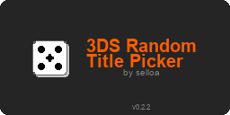
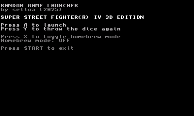

<p align="center">
  
</p>

# 3DS Random Game Launcher

Can't decide what to play? Let your 3DS pick a random installed title and launch it.



## Download

**[View on Universal-DB](https://db.universal-team.net/3ds/3ds-random-game-launcher)** — install with **[Universal Updater](https://github.com/Universal-Team/Universal-Updater)** on your 3DS.

After a new [GitHub Release](https://github.com/selloa/3DS-Random-Game-Launcher/releases) is published, Universal Updater picks it up automatically (usually within a few hours).

1. Open **Universal Updater** on your 3DS
2. Search for **"3DS Random Game Launcher"**
3. Install the **CIA** (Home Menu icon) or **3DSX** (Homebrew Launcher)

**Manual install:** download the latest `.3dsx` or `.cia` from [GitHub Releases](https://github.com/selloa/3DS-Random-Game-Launcher/releases).

- **3DSX:** copy to `/3ds/` on your SD card, launch from Homebrew Launcher
- **CIA:** install with FBI or Universal Updater, launch from the Home Menu

## What it does

- Picks a **random eligible title** from your library and launches it
- Shows a **readable name** (from the title's SMDH icon when available, offline catalog as fallback)
- **Reroll** as many times as you like before launching
- **Filter** what can be picked: native apps, Virtual Console, DSiWare, demos, DLC, patches, system titles, and more
- Scan **SD card** and/or **NAND** (both configurable)
- **Unlisted mode** for homebrew and titles not in the database (requires a readable SMDH name)
- **Options saved to SD** — your filters and preferences persist between sessions

While viewing a pick, use **L/R** to page through game, detail, and technical info screens.

## Controls

| Button | Action |
|--------|--------|
| **A** | Launch the selected title |
| **Y** | Reroll |
| **L / R** | Change info page |
| **X** | Quick toggle unlisted/homebrew-only mode |
| **SELECT** | Options / filters |
| **START** | Exit |

In the options menu: **Up/Down** to move, **A** to toggle or restore defaults, **B** or **SELECT** to close (saves settings).

## Community

- [r/3dshacks discussion](https://www.reddit.com/r/3dshacks/comments/1nazswi/comment/onf3mls/)
- [GBATemp release thread](https://gbatemp.net/threads/3ds-random-game-launcher-finally-something-to-solve-the-what-should-i-play-problem.675053/)

## Feedback & contributions

- [Report a bug or request a feature](https://github.com/selloa/3DS-Random-Game-Launcher/issues)
- [Pull requests welcome](https://github.com/selloa/3DS-Random-Game-Launcher/pulls)
- Distribution details: [docs/distribution/UNIVERSAL_UPDATER_SETUP.md](docs/distribution/UNIVERSAL_UPDATER_SETUP.md)

---

## Building (developers)

**Dependencies:** [devkitPro](https://devkitpro.org/) with devkitARM and 3ds-dev libraries.

```bash
git clone https://github.com/selloa/3DS-Random-Game-Launcher.git
cd 3DS-Random-Game-Launcher
make
```

The build reads semver from [`VERSION`](VERSION) and writes to `dist/`, e.g. `3DS-Random-Game-Launcher-v<VERSION>.3dsx`. See [docs/VERSIONING.md](docs/VERSIONING.md).

`make` does **not** regenerate banner PNGs — it only embeds `icon.png` in the `.3dsx` SMDH. To refresh store/CIA banner artwork (including the version label), run `build.bat banners` (Windows) or `./build.sh banners` (Linux/Mac) before `build_cia.bat`.

```bash
# Windows (PowerShell — preferred if cmd/app picker acts up)
./build.ps1 release
./build.ps1 debug
./build.ps1 banners
./build.ps1 clean

# Windows (batch)
./build.bat release
./build.bat debug
./build.bat banners
./build.bat clean

# Linux/Mac
./build.sh release
./build.sh debug
./build.sh banners
./build.sh clean
```

**CIA builds:** run `build.bat banners` then `build_cia.bat` (Windows) or `./build.sh banners` before packaging — see [tools/README.md](tools/README.md). Uses prebuilt tools in `tools/bin/` — no submodules.

**Debug build:** `make DEBUG=1` — adds `-debug` to output filenames and verbose logging.

### Project map

| Path | What it is |
|------|------------|
| `source/` | App source (`main.c`, `title_picker.c`, `title_smdh.c`, `settings.c`, `ui.c`, …) |
| `Makefile`, `build.bat`, `build.sh` | Build `.3dsx` homebrew |
| `build_cia.bat` | One-step `.cia` packaging (Windows) |
| `meta/banner-src/` | Config-driven banner generator — see [meta/banner-src/README.md](meta/banner-src/README.md) |
| `dist/` | Versioned build output (gitignored) |
| `scripts/` | Python tools to refresh the title database |
| `meta/` | Distribution assets — see [meta/README.md](meta/README.md) |
| `tools/` | CIA build binaries, RSF, and tooling docs |
| `docs/` | Developer and tester documentation |

### Documentation

- [docs/README.md](docs/README.md) — full doc index
- [docs/VERSIONING.md](docs/VERSIONING.md) — semver and releases
- [docs/TITLE_RESOLUTION_ROADMAP.md](docs/TITLE_RESOLUTION_ROADMAP.md) — title lookup roadmap
- [docs/MAIN_C_FUNCTIONALITY.md](docs/MAIN_C_FUNCTIONALITY.md) — how `main.c` works
- [docs/TESTING_GUIDE.md](docs/TESTING_GUIDE.md) — testing checklist

### Game database

The offline catalog in `source/title_database.c` maps title IDs to display names (**8,700+ entries**). Regenerate with `scripts/build_title_database.py`.

**Sources** (see [docs/TITLE_RESOLUTION_ROADMAP.md](docs/TITLE_RESOLUTION_ROADMAP.md)):

1. [hax0kartik/3dsdb](https://github.com/hax0kartik/3dsdb/tree/master/jsons) — regional eShop JSONs
2. [ghost-land/3dsdb](https://github.com/ghost-land/3dsdb) — bulk category JSON
3. [3dsdb.com](https://3dsdb.com/xml.php) — XML gap fill

On-device, **SMDH names take priority** over the catalog when available.

## What's next

Ideas for future versions:

- **GUI overhaul** — proper UI instead of console text
- **Game carousel** — browse picks with covers
- **Favorites / blacklist** — customize the random pool
- **Play stats** — track what you actually launch

## Credits

- **einso** — original concept and implementation
- **DevkitPro team** — [3ds-examples app_launch template](https://github.com/devkitPro/3ds-examples/blob/master/app_launch/source/main.c)
- **3DS homebrew community** — keeping the scene alive

Started as a proof-of-concept; this fork adds SMDH title resolution, filtering, persistent settings, and a rebuilt offline catalog.

## License

MIT License — Copyright (c) 2025 selloa

See [LICENSE](LICENSE) for the full text. Source files are marked `SPDX-License-Identifier: MIT`.

Third-party components (libctru, devkitPro toolchain) are documented in [docs/THIRD_PARTY_LICENSES.md](docs/THIRD_PARTY_LICENSES.md).

---

*Built with libctru.*
