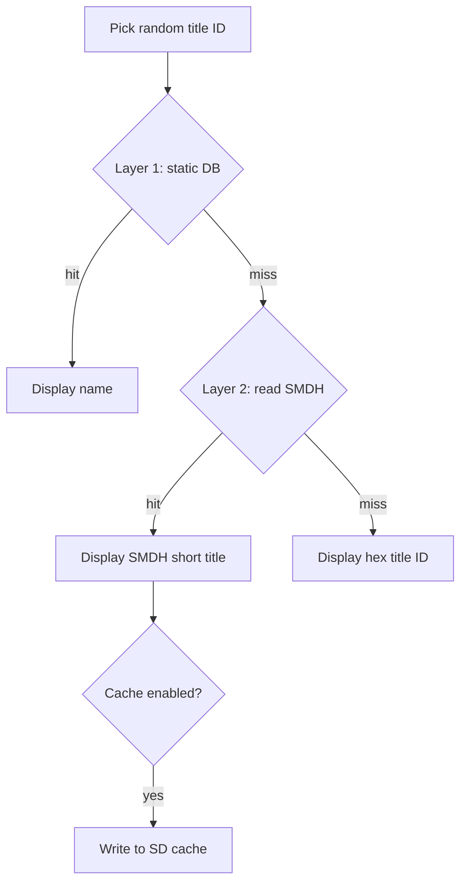

# Title Resolution Roadmap

How the app resolves installed title IDs to display names, what's shipped today, and what's next.

## Current behavior

1. `AM_GetTitleList` returns title IDs from the SD card — **no names**.
2. The picker draws randomly from **all** installed SD titles — **no content-category filter** is active in `main.c` (legacy `0x00`/`0x02` filter is commented out).
3. `lookup_game_name()` searches a static array in `source/title_database.c` (**8,714 entries**, rebuilt May 2026).
4. If no match and homebrew mode is off, the app rerolls (silently shrinking the pool).
5. If no match and homebrew mode is on, the app shows the raw 16-digit hex ID.

The offline database is regenerated via `scripts/build_title_database.py` (hax0kartik → ghost-land/3dsdb → 3dsdb.com XML). See [scripts/README.md](../scripts/README.md).

**Remaining gap:** titles on a real SD card may still be missing from the catalog, or the picker may surface title types users don't want (updates, DLC, etc.). Hardware testing will drive both SMDH fallback (Layer 2) and picker filtering rules (Phase 1c).

## Design principle

Use a **hybrid offline system** — no runtime HTTP on the 3DS.

| Layer | Role | Status |
|-------|------|--------|
| **1 — Static database** | Fast lookup for known titles | **Shipped** — 8,714 entries; merge script in `scripts/` |
| **1c — Picker filtering** | Limit what gets randomly launched (categories, user prefs) | **Not implemented** — after hardware testing |
| **2 — On-device SMDH read** | Read the installed title's own metadata when the DB misses | Planned |
| ~~Runtime API on 3DS~~ | ~~Fetch names over WiFi at pick time~~ | **Out of scope** — fragile, slow, endpoints die |

Final fallback when both layers fail: show hex title ID (or product code if cheap to obtain).

---

## Layer 1 — Offline database (PC-side)

**Goal:** Ship a comprehensive, maintainable `title_database.c` regenerated from multiple sources in one step.

The offline catalog should be **as complete as possible**. Include all ghost-land/3dsdb categories (base, Virtual Console, DSiWare, updates, DLC, videos). `themes` and `extras` are not in the bulk JSON export (Nlib also reports 0). Filtering what the random picker actually launches belongs in **app logic** (`main.c`), not in the database build — we can exclude categories later without re-fetching.

### Source priority and merge rules

Sources are applied **in order**. When a title ID already exists, **keep the existing name** (first writer wins).

| Priority | Source | Role | Endpoints / files |
|----------|--------|------|-------------------|
| **1** | [hax0kartik/3dsdb](https://github.com/hax0kartik/3dsdb/tree/master/jsons) | **Primary seed** — eShop display names | `list_US.json`, `list_GB.json`, `list_JP.json`, `list_KR.json`, `list_TW.json` |
| **2** | [ghost-land/3dsdb](https://github.com/ghost-land/3dsdb) | **Gap fill + full coverage** — bulk category JSON | `data/initial_data/*.json` |
| **3** | [3dsdb.com](https://3dsdb.com/xml.php) | **Last-resort gap fill** — cartridge/scene catalog | `https://3dsdb.com/xml.php` |

**Retired — do not use for offline builds:** [ghost-land/3DSDBAPI](https://github.com/ghost-land/3DSDBAPI) / `api.ghseshop.cc` (archived; DNS dead).

**Not used for 3DS:** [blawar/titledb](https://github.com/blawar/titledb) is **Switch-only** (`01…` TIDs). [Nlib API](https://github.com/ghost-land/nlib-api) syncs titledb for `/nx` only; its `/ctr` data comes from ghost-land/3dsdb. Use the GitHub JSON directly instead of per-title API calls.

#### Within hax0kartik (priority 1)

Regional JSON files are merged in this order (first name kept on duplicate title IDs):

**US → GB → JP → KR → TW**

The hax0kartik fetcher currently ingests eShop list entries and skips obvious update rows in names. It does **not** aim to cover updates, DLC, or every VC/DSiWare row — ghost-land/3dsdb fills that gap.

#### Within ghost-land/3dsdb (priority 2)

Download bulk JSON from `data/initial_data/` (six files, ~seconds total):

| File | Category | Notes |
|------|----------|-------|
| `games.json` | base | ~5,300+ retail / eShop apps |
| `dsiware.json` | dsiware | DSiWare titles |
| `virtual-console.json` | virtual-console | VC titles |
| `updates.json` | updates | Title updates (`0004000E…`) |
| `dlc.json` | dlc | Downloadable content |
| `videos.json` | videos | eShop video content |

Each row has `tid` and `name`. Merge only IDs **not already present** from step 1.

ghost-land/3dsdb is the **authoritative superset** for 3DS catalog completeness. hax0kartik names win on conflict because they tend to be cleaner eShop display strings.

**Not in bulk JSON:** `themes`, `extras` (no rows in `initial_data/`; Nlib also reports 0).

#### Within 3dsdb.com XML (priority 3)

Add title IDs still missing after steps 1–2. Treat names as lower quality (scene/release naming). Run through the same display-character cleaners.

#### Name cleaning (all sources)

Apply before writing C code:

- TM / ® → `(TM)` / `(R)`
- Strip HTML (`<br>`, etc.)
- Normalize smart quotes and dashes for 3DS console font
- Collapse whitespace

Do **not** strip update suffixes from names at build time — keep source strings as-is so updates remain identifiable. App filtering can ignore them later.

#### Catalog vs picker scope

| Concern | Where it lives |
|---------|----------------|
| **Offline catalog** (`title_database.c`) | ghost-land categories + hax0kartik + XML gaps — maximum coverage |
| **Random picker pool** (`main.c`) | **No filter today** — any installed title in the DB can be picked. Future app filters (e.g. base + VC + DSiWare only; exclude updates/DLC/system) will be designed after hardware testing |

---

### Phase 1a — hax0kartik-only refresh (interim)

- [x] Update `scripts/fetch_3dsdb_complete.py` for current JSON format (`list_US.json`, etc.)
- [x] Add display-character cleaning (TM, HTML tags, smart quotes)
- [x] Add `--dry-run` preview mode
- [x] Superseded by Phase 1b merge script

### Phase 1b — Multi-source merge script

Replace ad hoc manual stitching with a single PC tool:

```
fetch hax0kartik regional JSONs (US→GB→JP→KR→TW)
    → seed catalog + names
fetch ghost-land/3dsdb data/initial_data/*.json
    → add missing title IDs + names
fetch 3dsdb.com/xml.php
    → add missing title IDs + names
    → clean ─► sort by title ID ─► title_database.c
```

Tasks:

- [x] Create `scripts/build_title_database.py` implementing the priority order above
- [x] ghost-land/3dsdb pass: `games`, `dsiware`, `virtual-console`, `updates`, `dlc`, `videos`
- [x] Reuse cleaners via `scripts/title_db_common.py`
- [x] `--dry-run` writes `source/title_database_generated.c` without overwriting
- [x] Timestamped backup before overwriting `source/title_database.c`
- [x] Document source priority and merge rules (this file)
- [x] Apply full merge to `source/title_database.c` and verify build (**8,714 entries**)
- [ ] Ship updated database in a release
- [ ] Add to release checklist: regenerate DB before tagging
- [x] Update `scripts/README.md`

Merge result (May 2026): **8,714** unique CTR title IDs — up from **4,135** in the previous database. Step 1 alone contributed 4,199 hax0kartik base titles; ghost-land added updates, VC, DSiWare, DLC, and videos.

### Phase 1c — Hardware testing and picker filtering (next)

**Goal:** Validate the rebuilt catalog on real hardware, then implement picker-side rules in `main.c` based on what actually works for users.

**Approach:** keep the **no-filtering** picker for initial hardware tests so we observe the full installed library behavior. Filtering and homebrew UX will be expanded only after test feedback.

- [ ] Hardware test pass with 8,714-entry database (name resolution, reroll behavior, launch success)
- [ ] Document which title types users want included/excluded (base, VC, DSiWare, updates, DLC, system, homebrew)
- [ ] Implement content-category and/or user-configurable picker filters in `main.c`
- [ ] Expand homebrew mode (SMDH names, clearer UI, optional separate pool)
- [ ] Update user-facing docs once filter defaults are chosen

### Data sources reference

| Source | URL | Status | Role |
|--------|-----|--------|------|
| hax0kartik/3dsdb | https://github.com/hax0kartik/3dsdb/tree/master/jsons | Static since Feb 2023; still fetchable | Priority 1 — eShop names |
| ghost-land/3dsdb | https://github.com/ghost-land/3dsdb | Bulk JSON; fast | Priority 2 — full 3DS catalog |
| 3dsdb.com XML | https://3dsdb.com/xml.php | Intermittent; currently up | Priority 3 — gap fill |
| blawar/titledb | https://github.com/blawar/titledb | Switch only | Not used for 3DS |
| Nlib API | https://api.nlib.cc/ctr | Online | Reference / media only — do not fetch per-title for builds |
| ~~ghseshop / 3DSDBAPI~~ | ~~https://api.ghseshop.cc~~ | **Retired** | — |

---

## Layer 2 — On-device SMDH fallback

**Goal:** When the static DB misses, read the **installed title's own name** from SMDH metadata (same data the Home Menu uses). Works offline and matches what's actually on the SD card.

### How it works

Every installed CIA/cartridge title stores an SMDH at ExeFS `icon` (0x36C0 bytes). It contains localized `shortDescription` / `longDescription` in UTF-16.

```
title ID picked
    → lookup_game_name()          [Layer 1 — fast]
    → if NULL: read SMDH from title archive  [Layer 2 — accurate]
    → pick system language, fallback to English
    → if still empty: show hex title ID
```

Reference implementations: JKSM (`loadSMDH`), hbmenu SMDH parsing.

### Phase 2a — Core SMDH reader

- [ ] Add `source/title_smdh.c` / `title_smdh.h`
- [ ] Open installed title archive via FS (program NCCH on SD)
- [ ] Read and parse SMDH; extract short title for `CFG_LANGUAGE`
- [ ] Convert UTF-16 title to UTF-8 for console display
- [ ] Handle failures gracefully (corrupt title, missing icon, homebrew with empty SMDH)

### Phase 2b — Integrate into main loop

- [ ] Call SMDH lookup only when `lookup_game_name()` returns NULL
- [ ] Update display logic in `main.c` (remove hex-only fallback for resolvable titles)
- [ ] Revisit homebrew mode — expand after hardware testing and SMDH integration (basic hex-ID fallback exists today)

### Phase 2c — SD cache (optional performance pass)

Reading SMDH per reroll is slower than a C array lookup. Optional follow-up:

- [ ] Cache `{title_id → name}` to `/3ds/RandomGameLauncher/title_cache.bin` on SD
- [ ] Load cache at startup; write on first SMDH resolve
- [ ] Invalidate cache entry if title is uninstalled (or version bump the cache format)

Not required for initial Layer 2 ship; add if reroll latency is noticeable on hardware.

---

## Lookup flow (target architecture)



---

## Out of scope

- **Runtime HTTP on 3DS** — WiFi dependency, dead endpoints, latency; refresh the static DB on PC instead.
- **Online-only name resolution** — same reasons.
- **Scraping eShop at runtime** — not feasible on device.

---

## Related files

| Path | Role |
|------|------|
| `source/main.c` | Title picking and display; **no category filter active** — filtering planned in Phase 1c |
| `source/title_database.c` | Layer 1 static lookup table |
| `scripts/build_title_database.py` | Unified merge tool (Layer 1b) |
| `scripts/title_db_common.py` | Shared cleaners and catalog merge helpers |
| `scripts/fetch_3dsdb_complete.py` | hax0kartik-only fetch (interim) |
| `scripts/fetch_3dsdb_api.py` | Legacy Nlib API fetch (reference only) |
| `scripts/fix_display_issues.py` | Post-process cleaning for generated C |
| `scripts/README.md` | Script usage |

## Testing checklist

### Layer 1 — offline database (in progress)

- [ ] Game in DB → shows DB name on hardware
- [ ] Update / DLC / VC / DSiWare title in DB → name resolves when picked
- [ ] Title installed but missing from DB → reroll (or hex ID with homebrew mode)
- [ ] Large library (100+ titles) — acceptable reroll latency
- [x] Regenerated DB from merge script builds on PC
- [x] Merge stats logged: counts per source, duplicates skipped

### Layer 2 — SMDH fallback (when implemented)

- [ ] Retail CIA game missing from DB → shows SMDH name
- [ ] Homebrew with custom title ID + empty SMDH → hex fallback
- [ ] System language vs English fallback
