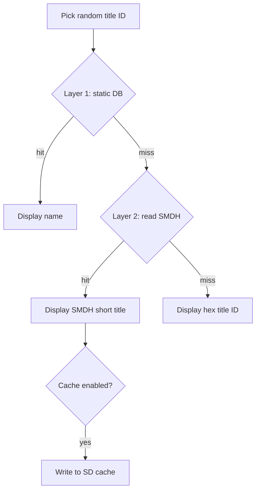

# Title Resolution Roadmap

How the app resolves installed title IDs to display names, what's broken today, and the planned fix.

## Current behavior

1. `AM_GetTitleList` returns title IDs from the SD card — **no names**.
2. `lookup_game_name()` searches a static array in `source/title_database.c`.
3. If no match and homebrew mode is off, the app rerolls (silently shrinking the pool).
4. If no match and homebrew mode is on, the app shows the raw 16-digit hex ID.

The database was built from community sources (ghseshop API, hax0kartik/3dsdb JSON, 3dsdb.com XML) via separate scripts and manual cleanup. There is no unified merge pipeline today.

**Known gap:** many titles on a real SD card are not in the offline database, so users see hex IDs or miss games entirely.

## Design principle

Use a **hybrid offline system** — no runtime HTTP on the 3DS.

| Layer | Role | Status |
|-------|------|--------|
| **1 — Static database** | Fast lookup for known titles | Exists; needs rebuild pipeline |
| **2 — On-device SMDH read** | Read the installed title's own metadata when the DB misses | Planned |
| ~~Runtime API on 3DS~~ | ~~Fetch names over WiFi at pick time~~ | **Out of scope** — fragile, slow, endpoints die |

Final fallback when both layers fail: show hex title ID (or product code if cheap to obtain).

---

## Layer 1 — Offline database (PC-side)

**Goal:** Ship a comprehensive, maintainable `title_database.c` regenerated from multiple sources in one step.

The offline catalog should be **as complete as possible**. Include every title type Nlib tracks (base, Virtual Console, DSiWare, updates, DLC, themes, videos, extras). Filtering what the random picker actually launches belongs in **app logic** (`main.c`), not in the database build — we can exclude categories later without re-fetching.

### Source priority and merge rules

Sources are applied **in order**. When a title ID already exists, **keep the existing name** (first writer wins).

| Priority | Source | Role | Endpoints / files |
|----------|--------|------|-------------------|
| **1** | [hax0kartik/3dsdb](https://github.com/hax0kartik/3dsdb/tree/master/jsons) | **Primary seed** — eShop display names | `list_US.json`, `list_GB.json`, `list_JP.json`, `list_KR.json`, `list_TW.json` |
| **2** | [Nlib API](https://github.com/ghost-land/nlib-api) | **Gap fill + full coverage** — all `/ctr` categories | `https://api.nlib.cc/ctr/category/{category}`, `…/ctr/{tid}?fields=name` |
| **3** | [3dsdb.com](https://3dsdb.com/xml.php) | **Last-resort gap fill** — cartridge/scene catalog | `https://3dsdb.com/xml.php` |
| **4** | [ghost-land/3dsdb](https://github.com/ghost-land/3dsdb) | **Optional enrichment** — per-title metadata repo | GitHub tree (future use) |

**Retired — do not use:** [ghost-land/3DSDBAPI](https://github.com/ghost-land/3DSDBAPI) / `api.ghseshop.cc` (archived Nov 2025; DNS dead). Functionality lives under Nlib `/ctr`.

#### Within hax0kartik (priority 1)

Regional JSON files are merged in this order (first name kept on duplicate title IDs):

**US → GB → JP → KR → TW**

The hax0kartik fetcher currently ingests eShop list entries and skips obvious update rows in names. It does **not** aim to cover updates, DLC, or every VC/DSiWare row — Nlib fills that gap.

#### Within Nlib (priority 2)

Fetch **every category** Nlib exposes under `/ctr`:

| Category | Example Nlib count (May 2026) | Notes |
|----------|-------------------------------|-------|
| `base` | ~3,512 | Retail / eShop applications |
| `virtual-console` | ~623 | VC titles |
| `dsiware` | ~1,202 | DSiWare |
| `updates` | ~477 | Title updates (`0004000E…`) |
| `dlc` | varies | Downloadable content |
| `videos` | ~27 | eShop video content |
| `extras` | varies | Additional content |
| `themes` | varies | System themes |

For each category: `GET /ctr/category/{category}` → title ID list → `GET /ctr/{tid}?fields=name` for IDs **not already present** from step 1.

Nlib is the **authoritative superset** for catalog completeness. hax0kartik names win on conflict because they tend to be cleaner eShop display strings.

#### Within 3dsdb.com XML (priority 3)

Add title IDs still missing after steps 1–2. Treat names as lower quality (scene/release naming). Run through the same display-character cleaners.

#### Name cleaning (all sources)

Apply before writing C code:

- TM / ® → `(TM)` / `(R)`
- Strip HTML (`<br>`, etc.)
- Normalize smart quotes and dashes for 3DS console font
- Collapse whitespace

Do **not** strip update suffixes from names at build time — keep Nlib/hax0kartik strings as-is so updates remain identifiable. App filtering can ignore them later.

#### Catalog vs picker scope

| Concern | Where it lives |
|---------|----------------|
| **Offline catalog** (`title_database.c`) | All Nlib categories + hax0kartik + XML gaps — maximum coverage |
| **Random picker pool** (`main.c`) | App filters (e.g. base + VC + DSiWare only; exclude updates/DLC/system) — can change without re-fetching |

---

### Phase 1a — hax0kartik-only refresh (interim)

- [x] Update `scripts/fetch_3dsdb_complete.py` for current JSON format (`list_US.json`, etc.)
- [x] Add display-character cleaning (TM, HTML tags, smart quotes)
- [x] Add `--dry-run` preview mode
- [ ] Superseded by Phase 1b merge script (hax0kartik alone is no longer the target workflow)
- [ ] Apply full merge to `source/title_database.c` and verify build
- [ ] Ship updated database in a release

Dry-run (May 2026) found **4,199** unique base titles from hax0kartik alone vs **4,135** in the current database (+64). Full Nlib merge is expected to add substantially more (Nlib total ~5,841 across all categories).

### Phase 1b — Multi-source merge script

Replace ad hoc manual stitching with a single PC tool:

```
fetch hax0kartik regional JSONs (US→GB→JP→KR→TW)
    → seed catalog + names
fetch Nlib /ctr/category/* for ALL categories
    → add missing title IDs + names
fetch 3dsdb.com/xml.php
    → add missing title IDs + names
    → clean ─► sort by title ID ─► title_database.c
```

Tasks:

- [ ] Create `scripts/build_title_database.py` implementing the priority order above
- [ ] Nlib pass: all categories (`base`, `virtual-console`, `dsiware`, `updates`, `dlc`, `videos`, `extras`, `themes`)
- [ ] Reuse cleaners from `fetch_3dsdb_complete.py`
- [ ] `--dry-run` writes `source/title_database_generated.c` without overwriting
- [ ] Timestamped backup before overwriting `source/title_database.c`
- [x] Document source priority and merge rules (this file)
- [ ] Add to release checklist: regenerate DB before tagging
- [ ] Update `scripts/README.md` once the merge script ships

### Data sources reference

| Source | URL | Status | Role |
|--------|-----|--------|------|
| hax0kartik/3dsdb | https://github.com/hax0kartik/3dsdb/tree/master/jsons | Static since Feb 2023; still fetchable | Priority 1 — eShop names |
| Nlib API | https://api.nlib.cc/ctr | Online; maintained | Priority 2 — full catalog |
| 3dsdb.com XML | https://3dsdb.com/xml.php | Intermittent; currently up | Priority 3 — gap fill |
| ghost-land/3dsdb | https://github.com/ghost-land/3dsdb | Optional | Priority 4 — enrichment |
| ~~ghseshop / 3DSDBAPI~~ | ~~https://api.ghseshop.cc~~ | **Retired** | Replaced by Nlib |

---

## Layer 2 — On-device SMDH fallback

**Goal:** When the static DB misses, read the **installed title's own name** from SMDH metadata (same data the Home Menu uses). Works offline and matches what's actually on the SD card.

### How it works

Every installed CIA/cartridge title stores an SMDH at ExeFS `icon` (0x36C0 bytes). It contains localized `shortDescription` / `longDescription` in UTF-16.

```
title ID picked
    → lookup_game_name()          [Layer 1 — fast]
    → if NULL: read SMDH from title archive  [Layer 2 — accurate]
    → pick system language, fallback to English
    → if still empty: show hex title ID
```

Reference implementations: JKSM (`loadSMDH`), hbmenu SMDH parsing.

### Phase 2a — Core SMDH reader

- [ ] Add `source/title_smdh.c` / `title_smdh.h`
- [ ] Open installed title archive via FS (program NCCH on SD)
- [ ] Read and parse SMDH; extract short title for `CFG_LANGUAGE`
- [ ] Convert UTF-16 title to UTF-8 for console display
- [ ] Handle failures gracefully (corrupt title, missing icon, homebrew with empty SMDH)

### Phase 2b — Integrate into main loop

- [ ] Call SMDH lookup only when `lookup_game_name()` returns NULL
- [ ] Update display logic in `main.c` (remove hex-only fallback for resolvable titles)
- [ ] Revisit homebrew mode semantics — may become less critical once SMDH covers retail/CIA titles

### Phase 2c — SD cache (optional performance pass)

Reading SMDH per reroll is slower than a C array lookup. Optional follow-up:

- [ ] Cache `{title_id → name}` to `/3ds/RandomGameLauncher/title_cache.bin` on SD
- [ ] Load cache at startup; write on first SMDH resolve
- [ ] Invalidate cache entry if title is uninstalled (or version bump the cache format)

Not required for initial Layer 2 ship; add if reroll latency is noticeable on hardware.

---

## Lookup flow (target architecture)



---

## Out of scope

- **Runtime HTTP on 3DS** — WiFi dependency, dead endpoints, latency; refresh the static DB on PC instead.
- **Online-only name resolution** — same reasons.
- **Scraping eShop at runtime** — not feasible on device.

---

## Related files

| Path | Role |
|------|------|
| `source/main.c` | Title picking, display, and picker-side filtering |
| `source/title_database.c` | Layer 1 static lookup table |
| `scripts/build_title_database.py` | Planned unified merge tool (Layer 1b) |
| `scripts/fetch_3dsdb_complete.py` | hax0kartik-only fetch (interim / used by merge script) |
| `scripts/fetch_3dsdb_api.py` | Legacy Nlib fetch (reference for merge script) |
| `scripts/fix_display_issues.py` | Post-process cleaning for generated C |
| `scripts/README.md` | Script usage |

## Testing checklist (when implemented)

- [ ] Retail CIA game missing from DB → shows SMDH name
- [ ] Game in DB → shows DB name (no SMDH read needed)
- [ ] Update title ID in DB → name resolves (even if picker excludes it)
- [ ] VC / DSiWare title in DB → name resolves
- [ ] Homebrew with custom title ID + empty SMDH → hex fallback
- [ ] System language vs English fallback
- [ ] Large library (100+ titles) — acceptable reroll latency
- [ ] Regenerated DB from merge script builds and runs on hardware
- [ ] Merge stats logged: counts per source, duplicates skipped
