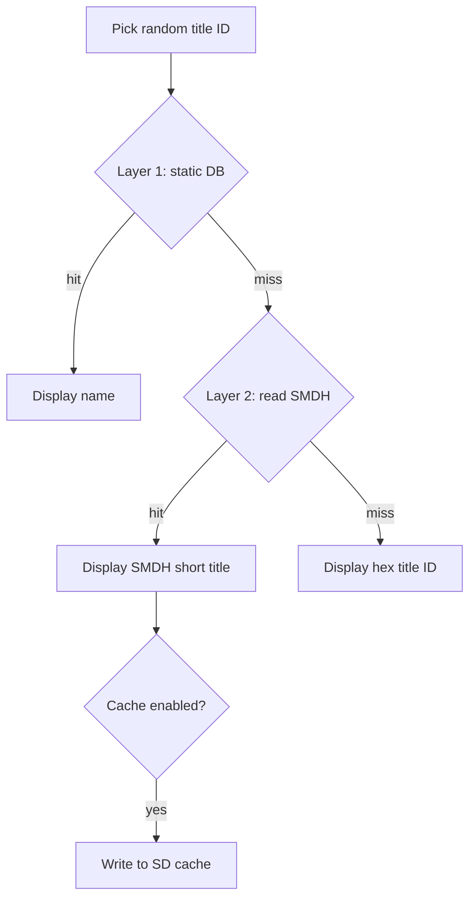

# Title Resolution Roadmap

How the app resolves installed title IDs to display names, what's broken today, and the planned fix.

## Current behavior

1. `AM_GetTitleList` returns title IDs from the SD card — **no names**.
2. `lookup_game_name()` searches a static array in `source/title_database.c`.
3. If no match and homebrew mode is off, the app rerolls (silently shrinking the pool).
4. If no match and homebrew mode is on, the app shows the raw 16-digit hex ID.

The database was built from community sources (ghseshop API, hax0kartik/3dsdb JSON, 3dsdb.com XML) via separate scripts and manual cleanup. There is no unified merge pipeline today.

**Known gap:** many titles on a real SD card are not in the offline database, so users see hex IDs or miss games entirely.

## Design principle

Use a **hybrid offline system** — no runtime HTTP on the 3DS.

| Layer | Role | Status |
|-------|------|--------|
| **1 — Static database** | Fast lookup for known titles | Exists; needs rebuild pipeline |
| **2 — On-device SMDH read** | Read the installed title's own metadata when the DB misses | Planned |
| ~~Runtime API on 3DS~~ | ~~Fetch names over WiFi at pick time~~ | **Out of scope** — fragile, slow, endpoints die |

Final fallback when both layers fail: show hex title ID (or product code if cheap to obtain).

---

## Layer 1 — Offline database (PC-side)

**Goal:** Ship a comprehensive, maintainable `title_database.c` regenerated from multiple sources in one step.

### Phase 1a — Refresh from hax0kartik/3dsdb (done in script, not yet applied)

- [x] Update `scripts/fetch_3dsdb_complete.py` for current JSON format (`list_US.json`, etc.)
- [x] Add display-character cleaning (TM, HTML tags, smart quotes)
- [x] Add `--dry-run` preview mode
- [ ] Apply refresh to `source/title_database.c` and verify build
- [ ] Ship updated database in a release

Dry-run (May 2025) found **4,199** unique base titles vs **4,135** in the current database (+64).

### Phase 1b — Multi-source merge script

Replace ad hoc manual stitching with a single PC tool:

```
fetch hax0kartik regional JSONs     ─┐
fetch ghseshop categories (if up)   ─┼─► dedupe by title ID ─► clean ─► title_database.c
optional: ghost-land/3dsdb          ─┘
```

Tasks:

- [ ] Create `scripts/build_title_database.py` (or extend `fetch_3dsdb_complete.py`) to merge all sources
- [ ] Prefer best name when duplicates conflict (e.g. prefer English short name, strip update suffixes)
- [ ] Filter to launchable base apps (`00040000…`), exclude updates/DLC/system
- [ ] Document which sources are primary vs fallback when endpoints are down
- [ ] Add to release checklist: regenerate DB before tagging

### Data sources reference

| Source | URL | Notes |
|--------|-----|-------|
| hax0kartik/3dsdb | https://github.com/hax0kartik/3dsdb/tree/master/jsons | Primary; regional eShop lists |
| ghseshop API | https://api.ghseshop.cc | VC + DSiWare categories; intermittent availability |
| 3dsdb.com XML | https://3dsdb.com/xml.php | Legacy; often down |
| ghost-land/3dsdb | https://github.com/ghost-land/3dsdb | Structured per-title metadata; optional enrichment |

---

## Layer 2 — On-device SMDH fallback

**Goal:** When the static DB misses, read the **installed title's own name** from SMDH metadata (same data the Home Menu uses). Works offline and matches what's actually on the SD card.

### How it works

Every installed CIA/cartridge title stores an SMDH at ExeFS `icon` (0x36C0 bytes). It contains localized `shortDescription` / `longDescription` in UTF-16.

```
title ID picked
    → lookup_game_name()          [Layer 1 — fast]
    → if NULL: read SMDH from title archive  [Layer 2 — accurate]
    → pick system language, fallback to English
    → if still empty: show hex title ID
```

Reference implementations: JKSM (`loadSMDH`), hbmenu SMDH parsing.

### Phase 2a — Core SMDH reader

- [ ] Add `source/title_smdh.c` / `title_smdh.h`
- [ ] Open installed title archive via FS (program NCCH on SD)
- [ ] Read and parse SMDH; extract short title for `CFG_LANGUAGE`
- [ ] Convert UTF-16 title to UTF-8 for console display
- [ ] Handle failures gracefully (corrupt title, missing icon, homebrew with empty SMDH)

### Phase 2b — Integrate into main loop

- [ ] Call SMDH lookup only when `lookup_game_name()` returns NULL
- [ ] Update display logic in `main.c` (remove hex-only fallback for resolvable titles)
- [ ] Revisit homebrew mode semantics — may become less critical once SMDH covers retail/CIA titles

### Phase 2c — SD cache (optional performance pass)

Reading SMDH per reroll is slower than a C array lookup. Optional follow-up:

- [ ] Cache `{title_id → name}` to `/3ds/RandomGameLauncher/title_cache.bin` on SD
- [ ] Load cache at startup; write on first SMDH resolve
- [ ] Invalidate cache entry if title is uninstalled (or version bump the cache format)

Not required for initial Layer 2 ship; add if reroll latency is noticeable on hardware.

---

## Lookup flow (target architecture)



---

## Out of scope

- **Runtime HTTP on 3DS** — WiFi dependency, dead endpoints, latency; refresh the static DB on PC instead.
- **Online-only name resolution** — same reasons.
- **Scraping eShop at runtime** — not feasible on device.

---

## Related files

| Path | Role |
|------|------|
| `source/main.c` | Title picking and display |
| `source/title_database.c` | Layer 1 static lookup table |
| `scripts/fetch_3dsdb_complete.py` | Current DB refresh tool (Layer 1a) |
| `scripts/fix_display_issues.py` | Post-process cleaning for generated C |
| `scripts/README.md` | Script usage |

## Testing checklist (when implemented)

- [ ] Retail CIA game missing from DB → shows SMDH name
- [ ] Game in DB → shows DB name (no SMDH read needed)
- [ ] Homebrew with custom title ID + empty SMDH → hex fallback
- [ ] System language vs English fallback
- [ ] Large library (100+ titles) — acceptable reroll latency
- [ ] Regenerated DB from merge script builds and runs on hardware
